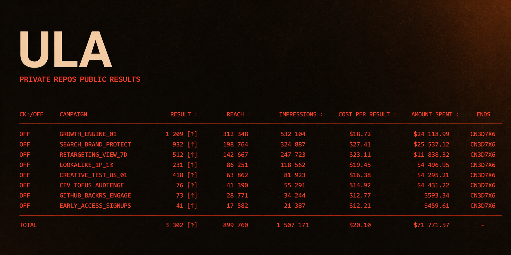

**One-person studio. Moscow. Ten products in flight, zero public code.**

---

The repos are private because they run. Live keys, live infrastructure, live users. Nothing here to fork. The products are the proof.

---

## Currently building

### 🔒 FKNG-MARK

> *My Fucking Marketing Engine, you now.*

A launch engine for micro-SaaS. One brief in. Forty-eight hours later, out comes deep competitor research, channel strategy, content for VK, Telegram, OK and Dzen, published posts, collected metrics, and an auto-recommendation — kill, iterate, or scale.

**How it's built.** Opus 4.7 runs the research agent through the Claude Agent SDK. Sonnet 4.6 runs strategy, long-form articles, and the decision layer. Haiku 4.5 runs the volume content. Flux handles imagery via Replicate. PostgreSQL and pg-boss carry the state and the queue. TypeScript strict, end-to-end.

V1 shipped in April 2026. V2 is the production core — four weeks of build, tested on a live product in the portfolio.

No open source on the roadmap.

---

## Portfolio

| Product | What it is | Where |
|---|---|---|
| **[ULA Lab](https://ulalab.online)** | Web tool that models how alcoholic agents shift green coffee flavor before roasting. Eighteen-SKU catalog with provenance, eight-axis flavor prediction (peat, medicinal, oak, sweetness, coast, fruit, floral, spice), confidence scoring for every forecast, batch-CSV pipeline. Built for Q-graders, fermentation specialists, and coffee R&D. Currently in CustDev interviews. | [ulalab.online](https://ulalab.online) |
| **Гадалка** *(Fortune Teller)* | Esoteric mini-app inside MAX messenger. Four tools — compatibility, daily tarot, name analysis, dream decoder. No pre-written templates; every reading generated fresh by DeepSeek V3.2 via Yandex AI Studio. Paid unlocks through YooKassa СБП. Launching into a market Telegram just vacated — Russia banned it April 1, 2026, and the esoteric niche inside MAX is empty. Window of opportunity comparable to early Telegram. | MAX messenger |
| **FarmFun** | Casual farming clicker for MAX. Built for women 35–55, three-to-four short sessions a day. Seasonal crops, plot unlocks, PvP steals, friend deep-links, weekly tournaments, streaks, push retention. Post-harvest AI advisor surfaces tips. Node.js, SQLite, Docker on Yandex Cloud. Monetization through plot upgrades and fertilizer packs. | MAX messenger |
| **Незнакомец** *(The Stranger)* | Cinematic romance-thriller visual novel for VK Mini App. After a breakup, the heroine starts getting messages from Mark — who knows too much about her. Not horror, not melodrama — something in between. Two hundred scenes, three chapters, three endings. Player's VK name auto-injected into dialogue. Mark voiced via ElevenLabs TTS. Running in a genre dominated by ten-year-old pixel art. | VK Mini App |
| **ULA Morta** | Debut coffee from the ULA brand. A concept object — intersection of taste, mythology, dark-medieval aesthetic, and packaging narrative. Laphroaig-10 barrel-soak on Honduras Washed beans, seventy-two-hour infusion, A/B/C variants in cupping. Cassette-format packaging in a Norelco case with five-panel J-card and vacuum-sealed 20g bag. Three-part narrative — Side A, Side B, Center. Limited first edition. | Limited release |
| **ULA Honey Horse** *(coming)* | ULA's second coffee release. Honey-infused as the warm counterpart to Morta — if Morta is dark-medieval, whisky, smoke and ash, Honey Horse is sunlit paganism, wild grass, slow amber. Same barrel-infusion method, opposite mood. Currently in development, first lot planned for Summer 2026. | In development |

---

## Stack

Claude does the thinking. Codex does the typing. I do the decisions.

Compliant distribution only. No grey-hat, no multi-accounting. The engine is legal-by-design.

---

## Contact

Telegram is the fastest line. Brand work, product collaborations, conversations about solo building in Russian-speaking markets — all fair game.

---

*Repos private. Products public. That's the whole deal.*

